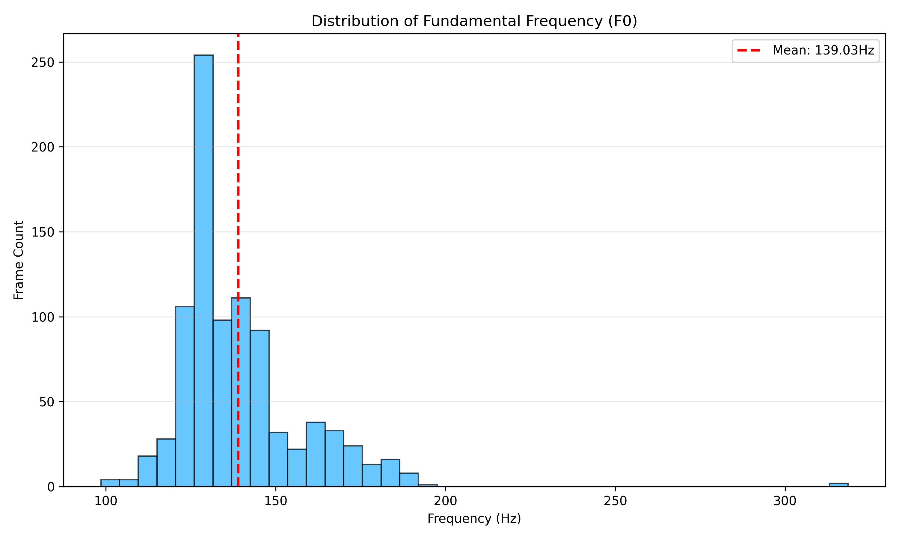
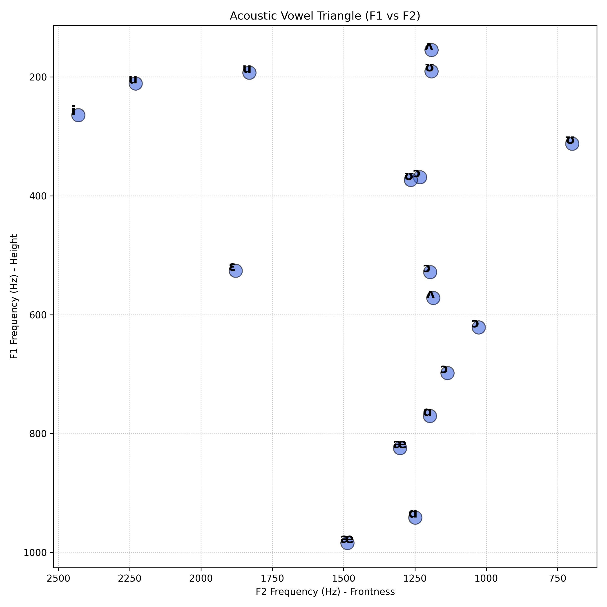
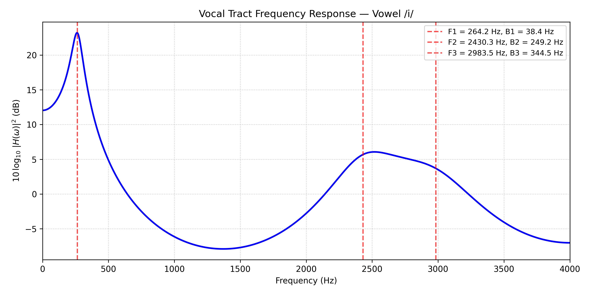
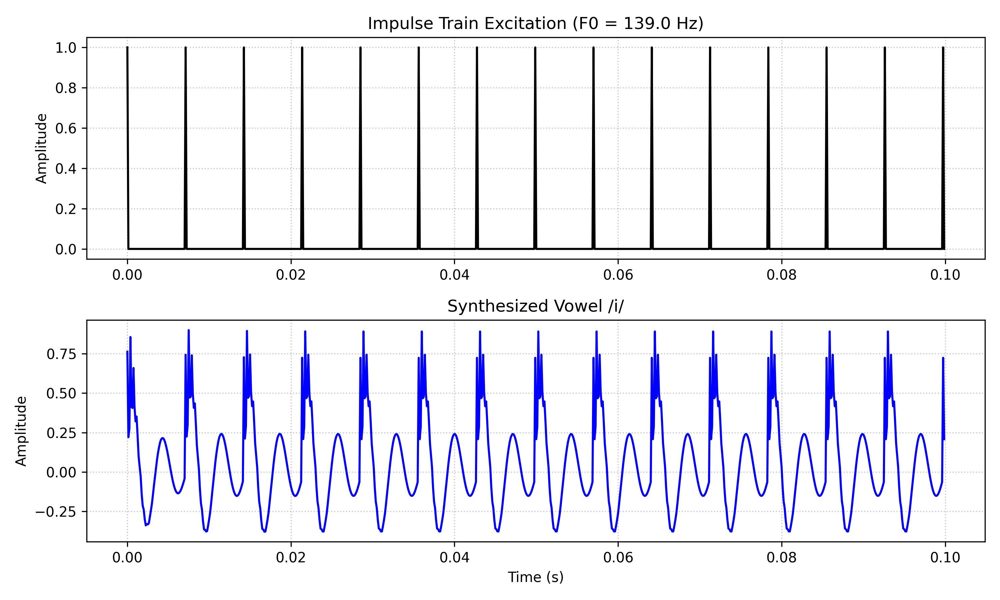
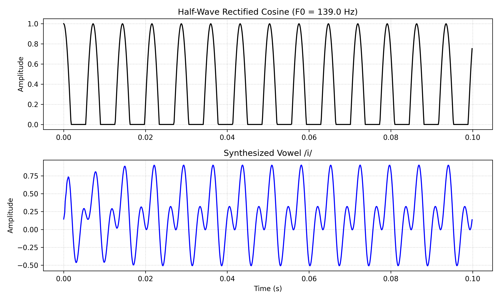
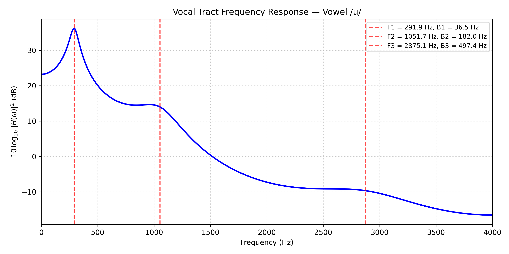
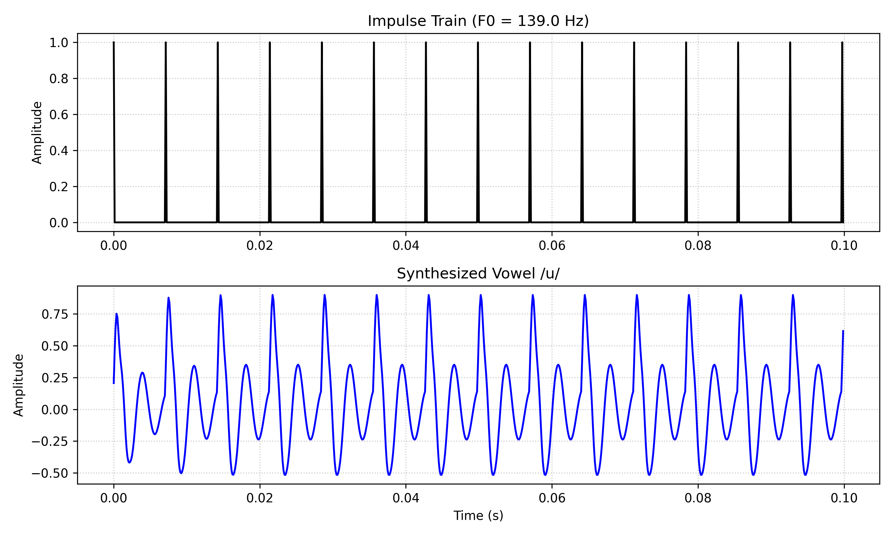
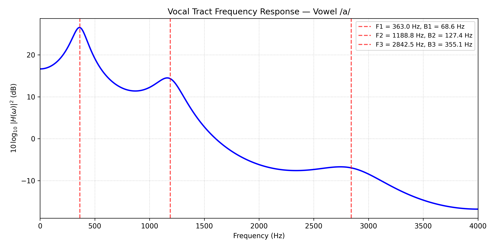
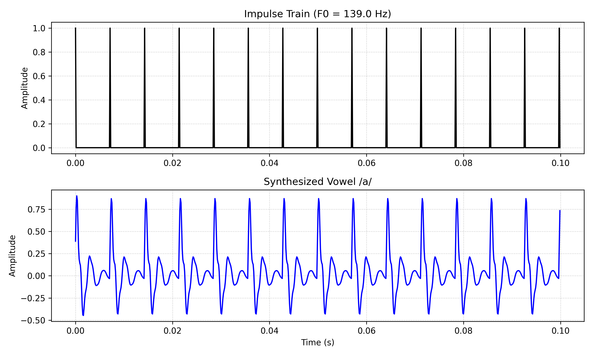

# Assignment 1

# P1: Speech Recording and Transcription

## a) Recording different audio samples

Summary of the audio samples recorded:

### Algorithm 1: Suggested Algorithm

- Name of the File: SNR value
- `sample_1_laptop_microphone_with_blank_areas.wav`: 100dB
- `sample_1_laptop_microphone.wav`: 33.374 dB
- `sample_2_WH720N_headphones_with_ANC_with_blank_spaces.wav`: 100dB
- `sample_2_WH720N_headphones_with_ANC.wav`: 100dB

**Key Observation**: This algorithm was giving 100dB for all samples, no matter how clean or noisy they were with the exception of laptop microphone. Therefore, I went through the comments of the code provided and switched to a different algorithm

**Gemini Suggestion**: Gemini suggested that the code is more familiar with 16kHz or 8kHz samples, so I resampled the audio to that, but still the SNR was stuck at 100dB.

### Algorithm 2: A more neater and closer to original WADA SNR version ([GitHub Link](https://gist.github.com/peter-grajcar/4e4ebd8b700cf3e4e9e3aaff603e8426))

Below is a summary of different types of audio recordings, their SNR values, and how the samples were procured.

| Audio File Name                                               | Estimated SNR (dB) | Status / Observation                       | Audio Procurement Method                                                                                       |
| ------------------------------------------------------------- | -----------------: | ------------------------------------------ | -------------------------------------------------------------------------------------------------------------- |
| sample_1_laptop_microphone.wav                                |              28.46 | Typical internal mic noise floor.          | Recorded using built-in laptop microphone                                                                      |
| sample_1_laptop_microphone_with_blank_areas.wav               |              33.02 | Slight variance due to zero-energy blocks. | Laptop microphone recording with silent segments inserted                                                      |
| sample_2_WH720N_headphones_with_ANC.wav                       |              74.98 | High quality, ANC effective.               | Sony WH-720N headphones with ANC enabled                                                                       |
| sample_2_WH720N_headphones_with_ANC_with_blank_spaces.wav     |              74.98 | Consistent results despite silence.        | ANC headphone recording with intentional silent gaps                                                           |
| sample_2_WH720N_headphones_without_ANC.wav                    |             100.00 | Algorithm saturation (original script).    | Headphone recording without ANC (untrimmed)                                                                    |
| sample_2_WH720N_headphones_without_ANC_trimmed.wav            |              42.41 | Realistic noisy environment estimate.      | Headphone recording without ANC, manually trimmed                                                              |
| sample_2_WH720N_headphones_without_ANC_trimmed_re-sampled.wav |             100.00 | Potential distribution mismatch.           | Trimmed headphone audio re-sampled to new rate                                                                 |
| sample_3_K8_wireless_microphone.wav                           |              46.51 | Base wireless performance.                 | Wireless K8 microphone recording with microphone held very close to audio source                               |
| sample_3_K8_wireless_microphone_take_2.wav                    |              56.11 | Good wireless capture quality.             | Wireless K8 microphone (second take), microphone at a moderate distance                                        |
| sample_3_K8_wireless_microphone_take_3.wav                    |              51.38 | Moderate wireless interference/noise.      | Wireless K8 microphone (third take), microphone at a moderate distance and words spoken very slowly but louder |

Additional information about the recording environment:

- Recording Software used: `Audacity 3.7.7`
- Microphone types used:
  - Laptop Microphone: `Microphone Array (2- Intel® Smart Sound Technology for Digital Microphones)`
  - Headphone Microphone: `Headset WH720N Sony Headphones`
  - Wireless Microphone: `K8 Wireless Microphone`
- Only one file `sample_2_WH720N_headphones_without_ANC_trimmed_re-sampled.wav` is recorded at 16kHz, rest all samples are recorded at 44.1kHz sampling rate
- The bit depth of all the fiels is set to be at `32 bit (float)`
- Sentences used: `List 6, first five sentences`
  1. The frosty air passed through the coat.
  2. The crooked maze failed to fool the mouse.
  3. Adding fast leads to wrong sums.
  4. The show was a flop from the very start.
  5. A saw is a tool used for making boards.

- Preferred audio sample for further processing: `sample_2_WH720N_headphones_with_ANC.wav`

## b) Labelling of each phoneme

There are 46 words and 108 phonemes.

# P2: Pitch and Formant Analysis

## Overview

This exercise performs acoustic analysis on a recorded speech sample to extract two fundamental properties of speech:

1. **Fundamental Frequency (F0)** — the rate of vocal fold vibration, perceived as pitch
2. **Formant Frequencies (F1, F2, F3)** — resonance frequencies of the vocal tract that determine vowel identity

The analysis uses the [Parselmouth](https://parselmouth.readthedocs.io/en/stable/) Python library, which provides a programmatic interface to [Praat](https://www.fon.hum.uva.nl/praat/), the standard tool for phonetic analysis.

### Input Files

| File                                           | Description                                                        |
| ---------------------------------------------- | ------------------------------------------------------------------ |
| `sample_2_WH720N_headphones_with_ANC.wav`      | Speech recording                                                   |
| `sample_2_WH720N_headphones_with_ANC.TextGrid` | Praat TextGrid with word (Tier 1) and phoneme (Tier 2) annotations |

---

## Part (a): Pitch (F0) Analysis

### Objective

Extract the fundamental frequency (F0) as a function of time, compute the average F0, and plot the distribution of F0 values across the recording.

### Methodology

1. **Pitch extraction**: The audio is loaded as a `parselmouth.Sound` object, and `snd.to_pitch()` is called to extract the pitch contour using Praat's autocorrelation-based algorithm.
2. **Voiced frame selection**: The pitch object returns F0 = 0 for unvoiced segments (silence, unvoiced consonants). These are filtered out to retain only voiced frames where F0 > 0.
3. **Average F0**: Computed as the arithmetic mean of all valid (voiced) F0 values.
4. **Visualization**: A histogram of the F0 distribution is plotted with the mean marked.

### Result



**Average F0: 139.03 Hz**

### Observations

- The F0 distribution is concentrated around the mean, indicating relatively stable pitch throughout the recording.
- An average F0 of ~139 Hz falls within the typical range for an adult male speaker (85–180 Hz).
- The spread in the histogram reflects natural pitch variation due to intonation, stress patterns, and prosody in continuous speech.

---

## Part (b): Formant Analysis and Vowel Triangle

### Objective

Extract the first three formant frequencies (F1, F2, F3) for all vowel segments in the recording and plot the acoustic vowel triangle (F1 vs F2 scatter plot).

### Methodology

1. **Formant extraction**: `snd.to_formant_burg()` applies the Burg method (linear prediction) to estimate formant frequencies and bandwidths across the entire recording.

2. **Vowel segmentation**: The TextGrid file contains phoneme-level annotations in Tier 2. The script iterates over all intervals in this tier, identifying vowel segments by matching labels against a predefined IPA vowel set:

   ```
   Monophthongs: i, ɪ, e, ɛ, æ, ɑ, ɔ, ʊ, u, ʌ, ə, ɝ
   Diphthongs:   aɪ, aʊ, eɪ, oʊ, ɔɪ
   ```

3. **Midpoint sampling**: For each identified vowel interval, formant values are sampled at the temporal midpoint $t_{mid} = (t_{start} + t_{end}) / 2$. The midpoint is chosen because it captures the **steady-state** portion of the vowel, minimizing coarticulatory effects from neighboring consonants.

4. **TextGrid access**: The Praat scripting interface is used via `parselmouth.praat.call()` with 1-based tier/interval indexing:
   - `"Get number of intervals..."` — total intervals in a tier
   - `"Get label of interval..."` — phoneme label
   - `"Get start time of interval..."` / `"Get end time of interval..."` — segment boundaries

5. **Vowel triangle plot**: F1 is plotted on the y-axis and F2 on the x-axis, with **both axes inverted** following the linguistic convention:
   - **Inverted y-axis (F1)**: High F1 (bottom) = open/low vowels; Low F1 (top) = close/high vowels
   - **Inverted x-axis (F2)**: High F2 (left) = front vowels; Low F2 (right) = back vowels

### Result



### Average Formant Frequencies

| Vowel | F1 (Hz) | F2 (Hz) | F3 (Hz) |
| ----- | ------- | ------- | ------- |
| i     | 264.18  | 2430.35 | 2983.53 |
| u     | 201.81  | 2029.95 | 2482.24 |
| æ     | 904.35  | 1394.72 | 2695.31 |
| ɑ     | 855.92  | 1223.24 | 3128.54 |
| ɔ     | 554.05  | 1148.02 | 2653.77 |
| ɛ     | 526.01  | 1878.54 | 2638.52 |
| ʊ     | 291.95  | 1051.69 | 2875.12 |
| ʌ     | 362.97  | 1188.76 | 2842.51 |

### Observations

1. **Vowel triangle structure**: The three corners of the classic acoustic vowel triangle are clearly identifiable:
   - **Top-left**: `i` (high front vowel) — lowest F1, highest F2
   - **Top-right**: `ʊ` / `u` (high back vowels) — low F1, low F2
   - **Bottom**: `æ` / `ɑ` (low/open vowels) — highest F1

2. **F1 encodes vowel height**:
   - Close/high vowels (`i`, `u`, `ʊ`) cluster at low F1 values (~200–300 Hz)
   - Open/low vowels (`æ`, `ɑ`) have high F1 values (~850–900 Hz)
   - Mid vowels (`ɛ`, `ɔ`, `ʌ`, `ə`) fall in between (~360–560 Hz)

3. **F2 encodes frontness/backness**:
   - Front vowels (`i`, `ɛ`) have high F2 (~1880–2430 Hz)
   - Back vowels (`ʊ`, `ɔ`, `ʌ`, `ɑ`) have low F2 (~1050–1225 Hz)
   - The F2 dimension clearly separates front from back vowels

4. **Schwa (`ə`)** would be expected near the center of the triangle, consistent with its role as the neutral/reduced vowel produced with a relaxed vocal tract.

---

## Files Generated

| File                             | Description                          |
| -------------------------------- | ------------------------------------ |
| `images/P2.a.f0_histogram.png`   | Histogram of F0 distribution         |
| `images/P2.b.vowel_triangle.png` | Acoustic vowel triangle scatter plot |

## Dependencies

```bash
pip install parselmouth numpy matplotlib pandas
```

# P3: Vowel Generation using Source-Filter Model

## Overview

This exercise constructs a **three-formant vocal tract transfer function** as a cascade of three second-order systems to synthesize vowel sounds. The transfer function models the resonances (formants) of the vocal tract:

$$H[z] = H_1[z] \cdot H_2[z] \cdot H_3[z]$$

where each stage is defined as:

$$H_i[z] = \frac{1}{(1 - r_i e^{j\theta_i} z^{-1})(1 - r_i e^{-j\theta_i} z^{-1})}, \quad i = 1, 2, 3$$

with parameters:

- $\theta_i = 2\pi F_i / F_s$ — maps formant frequency $F_i$ to angular frequency
- $r_i = e^{-2\pi B_i / F_s}$ — controls bandwidth (pole radius)
- $F_s = 8000$ Hz — sampling rate

Expanding the denominator of each stage gives the implementable form:

$$H_i[z] = \frac{1}{1 - 2r_i\cos(\theta_i)z^{-1} + r_i^2 z^{-2}}$$

The cascade $H[z]$ is obtained by convolving the denominator polynomials of all three stages.

---

## Source Data (from P2b)

### Formant Frequencies (Average)

| Vowel              | IPA | F1 (Hz) | F2 (Hz) | F3 (Hz) |
| ------------------ | --- | ------- | ------- | ------- |
| /i/ (as in "bit")  | i   | 264.18  | 2430.35 | 2983.53 |
| /u/ (as in "push") | ʊ   | 291.95  | 1051.69 | 2875.12 |
| /a/ (as in "fun")  | ʌ   | 362.97  | 1188.76 | 2842.51 |

### Pitch

- **Average F0**: 139.03 Hz

---

## Part (a): Frequency Response of Vocal Tract Transfer Function for /i/

### Objective

Construct the transfer function $H[z]$ for vowel /i/ using formant frequencies from P2b. Bandwidths are set as $B_i = F_i / Q$ where $Q$ is drawn randomly from $[5, 10]$.

### Chosen Parameters

| Formant | Frequency (Hz) | Q    | Bandwidth (Hz) |
| ------- | -------------- | ---- | -------------- |
| F1      | 264.18         | 6.87 | 38.44          |
| F2      | 2430.35        | 9.75 | 249.18         |
| F3      | 2983.53        | 8.66 | 344.52         |

### Methodology

1. For each formant, compute $\theta_i$ and $r_i$ from the formulas above.
2. Each second-order section has denominator coefficients $[1, -2r_i\cos(\theta_i), r_i^2]$.
3. The overall transfer function is obtained by convolving the three denominator polynomials.
4. The magnitude frequency response is computed using `scipy.signal.freqz` and plotted in logarithmic scale as $10\log_{10}|H(\omega)|^2$.

### Result



**Observations:**

- Three clear resonance peaks are visible at the formant frequencies F1, F2, and F3 (marked with red dashed lines).
- The peak at F1 (~264 Hz) is the sharpest due to the narrowest bandwidth (38.44 Hz), indicating a high Q factor.
- Higher formants have progressively broader peaks, consistent with their larger bandwidths.

---

## Part (b): Vowel Synthesis with Impulse Train Excitation

### Objective

Generate an impulse train of duration 1 second with period matching the average F0 (139.03 Hz), pass it through the vocal tract filter $H[z]$, and save the output as a `.wav` file.

### Methodology

1. **Excitation signal**: An impulse train with period $T_0 = F_s / F_0 = 8000 / 139.03 \approx 58$ samples. A single sample is set to 1.0 every $T_0$ samples; all others are zero.
2. **Filtering**: The excitation is passed through the cascade filter using `scipy.signal.lfilter(b, a, excitation)`.
3. **Normalization**: Output is scaled to 90% of peak amplitude to prevent clipping.

### Result



**Output file**: `P3.b.vowel_i_impulse_train.wav`

**Observations:**

- The top panel shows the periodic impulse train excitation.
- The bottom panel shows the filter output — each impulse excites the resonances of the vocal tract, producing a damped oscillatory response that decays before the next impulse arrives.
- The synthesized signal sounds like a buzzy, robotic /i/ vowel. The formant structure gives it the characteristic "ee"-like quality, though the impulse train excitation lacks the richness of natural glottal pulses.

---

## Part (c) [Bonus]: Vowel Synthesis with Half-Wave Rectified Cosine Excitation

### Objective

Replace the impulse train with a **half-wave rectified cosine** signal at the average F0 frequency as the excitation source.

### Methodology

1. **Excitation signal**: $x(t) = \max(\cos(2\pi F_0 t), 0)$. This retains only the positive half of the cosine, setting negative values to zero. This signal is smoother than the impulse train and has a richer harmonic structure that more closely resembles the glottal pulse.
2. **Filtering and normalization**: Same as Part (b).

### Result



**Output file**: `P3.c.vowel_i_halfwave_cosine.wav`

**Observations:**

- The excitation (top panel) is smoother than the impulse train, with gradual onsets and offsets in each period.
- The filter output (bottom panel) shows a more continuous, less "spiky" waveform compared to Part (b).
- The synthesized vowel sounds slightly more natural and less harsh than the impulse-train version, as the half-wave rectified cosine better approximates the spectral characteristics of a real glottal pulse.

---

## Part (d) [Bonus]: Vowel Synthesis for /u/ and /a/

### Objective

Repeat Parts (a) and (b) for vowel sounds /u/ (as in "push") and /a/ (as in "fun").

---

### Vowel /u/ (as in "push")

#### Chosen Parameters

| Formant | Frequency (Hz) | Q    | Bandwidth (Hz) |
| ------- | -------------- | ---- | -------------- |
| F1      | 291.95         | 7.99 | 36.52          |
| F2      | 1051.69        | 5.78 | 181.95         |
| F3      | 2875.12        | 5.78 | 497.43         |

#### Frequency Response



**Observations:**

- F1 and F2 are closer together compared to /i/, reflecting the back, closed nature of /u/.
- The F2 peak (~1052 Hz) is much lower than for /i/ (~2430 Hz), which is the primary acoustic cue distinguishing back vowels from front vowels.

#### Impulse Train Synthesis



**Output files**:

- `P3.d.vowel_u_impulse_train.wav`
- `P3.d.vowel_u_halfwave_cosine.wav`

**Observations:**

- The synthesized /u/ sounds noticeably different from /i/ — darker and more "oo"-like, consistent with the lower F2 frequency.

---

### Vowel /a/ (as in "fun")

#### Chosen Parameters

| Formant | Frequency (Hz) | Q    | Bandwidth (Hz) |
| ------- | -------------- | ---- | -------------- |
| F1      | 362.97         | 5.29 | 68.61          |
| F2      | 1188.76        | 9.33 | 127.40         |
| F3      | 2842.51        | 8.01 | 355.07         |

#### Frequency Response



**Observations:**

- F1 is higher than both /i/ and /u/, reflecting the more open vocal tract configuration for /a/.
- F1 and F2 are relatively close together (~363 Hz and ~1189 Hz), which is characteristic of central-to-back open vowels.

#### Impulse Train Synthesis



**Output files**:

- `P3.d.vowel_a_impulse_train.wav`
- `P3.d.vowel_a_halfwave_cosine.wav`

**Observations:**

- The synthesized /a/ has a distinctly more open quality compared to /i/ and /u/, consistent with its higher F1.

---

## Comparative Summary

### Formant Comparison Across Vowels

| Parameter    | /i/ (bit) | /u/ (push) | /a/ (fun) |
| ------------ | --------- | ---------- | --------- |
| F1 (Hz)      | 264.18    | 291.95     | 362.97    |
| F2 (Hz)      | 2430.35   | 1051.69    | 1188.76   |
| F3 (Hz)      | 2983.53   | 2875.12    | 2842.51   |
| F2 − F1 (Hz) | 2166.17   | 759.74     | 825.79    |

### Key Takeaways

1. **F1 correlates with vowel height**: /i/ (high vowel) has the lowest F1; /a/ (low/mid vowel) has the highest.
2. **F2 correlates with frontness**: /i/ (front vowel) has the highest F2; /u/ (back vowel) has the lowest.
3. **F2 − F1 gap**: Large gap for front vowels (/i/), small gap for back vowels (/u/, /a/).
4. **Excitation type matters**: The half-wave rectified cosine produces a more natural sound than the impulse train due to its smoother spectral envelope, which better approximates the glottal source.

---

## Files Generated

| File                                        | Description                                          |
| ------------------------------------------- | ---------------------------------------------------- |
| `P3.a.frequency_response.vowel_i.png`       | Magnitude frequency response for /i/                 |
| `P3.b.impulse_train_waveform.vowel_i.png`   | Excitation & output waveform for /i/ (impulse train) |
| `P3.b.vowel_i_impulse_train.wav`            | Synthesized /i/ audio (impulse train)                |
| `P3.c.halfwave_cosine_waveform.vowel_i.png` | Excitation & output waveform for /i/ (HW cosine)     |
| `P3.c.vowel_i_halfwave_cosine.wav`          | Synthesized /i/ audio (HW rectified cosine)          |
| `P3.d.frequency_response.vowel_u.png`       | Magnitude frequency response for /u/                 |
| `P3.d.impulse_train_waveform.vowel_u.png`   | Excitation & output waveform for /u/ (impulse train) |
| `P3.d.vowel_u_impulse_train.wav`            | Synthesized /u/ audio (impulse train)                |
| `P3.d.vowel_u_halfwave_cosine.wav`          | Synthesized /u/ audio (HW rectified cosine)          |
| `P3.d.frequency_response.vowel_a.png`       | Magnitude frequency response for /a/                 |
| `P3.d.impulse_train_waveform.vowel_a.png`   | Excitation & output waveform for /a/ (impulse train) |
| `P3.d.vowel_a_impulse_train.wav`            | Synthesized /a/ audio (impulse train)                |
| `P3.d.vowel_a_halfwave_cosine.wav`          | Synthesized /a/ audio (HW rectified cosine)          |
