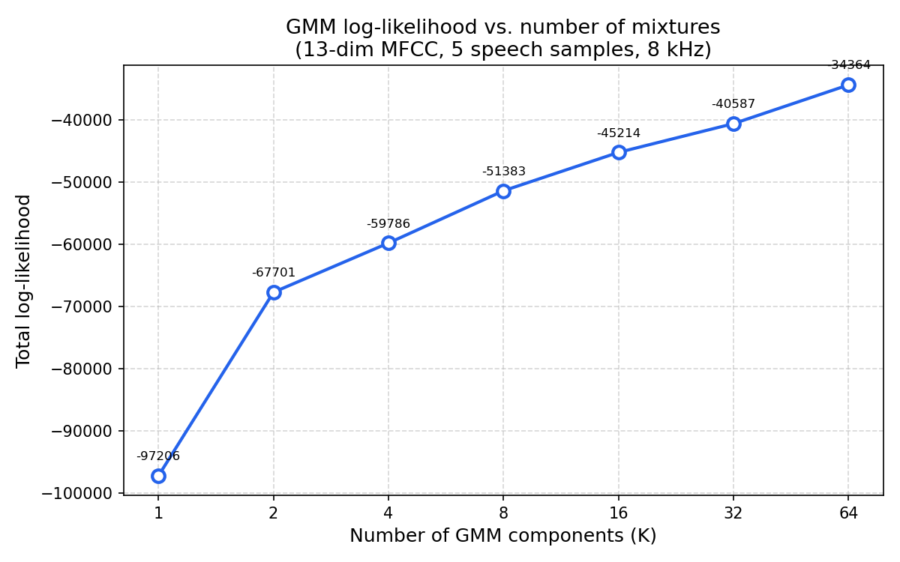
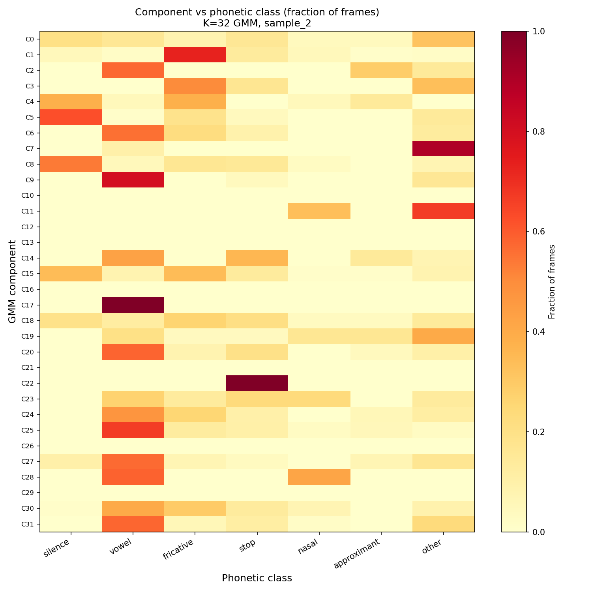
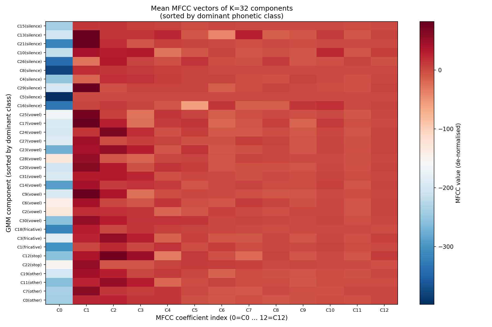

# EE 679: Speech Processing — Assignment 2

**Student:** Anupam Rawat  
**Roll No.:** (Roll No.)  
**Email:** anupam.rawat@iitb.ac.in  
**Submission Date:** 20 April 2026

---

## Table of Contents

1. [P1: Speech Enhancement](#p1-speech-enhancement)
   - [Recordings](#recordings)
   - [P1(a): Classical Enhancement — Audacity](#p1a-classical-enhancement--audacity-noise-reduction)
   - [P1(b): Neural Enhancement — DeepFilterNet](#p1b-neural-enhancement--deepfilternet)
   - [P1: Comparative Analysis](#p1-comparative-analysis)
2. [P2: Stochastic Modeling — Gaussian Mixture Model](#p2-stochastic-modeling--gaussian-mixture-model)
   - [P2(a): GMM via EM Algorithm](#p2a-gmm-implementation-via-em-algorithm)
   - [P2(b): MFCC Features and Log-likelihood vs. K](#p2b-mfcc-features-and-gmm-fitting)
   - [P2(c): Phonetic Inspection of GMM Components](#p2c-phonetic-inspection-of-k32-gmm-components)
   - [P2(d): Speaker Likelihood Comparison](#p2d-average-log-likelihood--same-vs-different-speaker)

---

# P1: Speech Enhancement

## Recordings

Three speech recordings were made at 44.1 kHz stereo using a laptop microphone:

| File | Noise condition | Duration |
|------|----------------|----------|
| `audio/R1.wav` | Speech + background music (moderate volume) | ~48 s |
| `audio/R2.wav` | Speech + keyboard typing (moderate speed) | ~30 s |
| `audio/R3.wav` | Speech + fan noise at high speed, 2 m from mic | ~42 s |

R1 serves as the relatively cleanest recording and is used as the pseudo-clean reference for metric computation.

---

## P1(a): Classical Enhancement — Audacity Noise Reduction

**Tool:** Audacity built-in noise reduction  
**Output:** `P1/classical/`

**Method:** A noise profile was sampled from a silent (speech-free) segment of each recording. The noise reduction filter was then applied across the full recording at default sensitivity.

**Observations:**

- **R1 (music):** Background music was partially attenuated. Suppression is subtle because music occupies a complex, time-varying spectrum that overlaps with speech.
- **R2 (keyboard):** Transient keyboard clicks are partially suppressed. Some residual impulsive artefacts remain since spectral subtraction is ill-suited to non-stationary impulsive noise.
- **R3 (fan):** Fan noise is stationary and broadband. Audacity performs well here — the noise profile estimation is accurate and the output is noticeably cleaner with minimal speech distortion.

---

## P1(b): Neural Enhancement — DeepFilterNet

**Tool:** [DeepFilterNet](https://github.com/rikorose/deepfilternet) v0.5.6 — model `DeepFilterNet3`, checkpoint epoch 120, running on CUDA  
**Script:** `P1/enhance_neural.py`  
**Output:** `P1/neural/` (48 kHz, DeepFilterNet native rate)

### Model Overview

DeepFilterNet3 is a deep neural network trained on the DNS Challenge dataset. It processes audio in the frequency domain using a two-stage architecture:

1. **Coarse stage:** An ERB-domain filter suppresses broadband noise.
2. **Fine stage:** A deep-filtering module removes residual artefacts at full frequency resolution.

The model runs in real time on GPU and requires no manual noise profile — it is fully automatic.

### Metric Computation

All metrics are computed at 16 kHz mono. Since R1, R2, and R3 contain different speech utterances, two comparison schemes are reported:

- **Table A** — each method vs. original R1 as pseudo-clean reference. Meaningful for R1 (same utterance); for R2/R3, only SNR is interpretable (PESQ/STOI require matching utterances).
- **Table B** — neural enhanced vs. classical enhanced within each recording (classical as reference), showing the relative difference between the two methods on identical audio.

### Results

**Table A: All methods vs. original R1**

| Recording | Method | SNR (dB) | PESQ | STOI |
|-----------|--------|:--------:|:----:|:----:|
| R1 | Original | +∞ | 4.644 | 1.0000 |
| R1 | Classical | +6.62 | 4.634 | 0.9987 |
| R1 | Neural | +8.14 | 1.121 | 0.8056 |
| R2 | Original | −1.62 | 1.152 | 0.0075 |
| R2 | Classical | −0.45 | 1.115 | 0.0075 |
| R2 | Neural | −0.74 | 1.081 | −0.008 |
| R3 | Original | −0.87 | 2.558 | 0.0302 |
| R3 | Classical | −0.27 | 2.992 | 0.0170 |
| R3 | Neural | −0.36 | 1.449 | 0.0308 |

> PESQ and STOI values for R2 and R3 are against R1 (a different utterance) and are not meaningful — refer to SNR and Table B for those recordings.

**Table B: Neural vs. classical (direct per-recording comparison)**

| Recording | SNR (dB) | PESQ | STOI |
|-----------|:--------:|:----:|:----:|
| R1 | +4.54 | 1.150 | 0.8071 |
| R2 | +6.28 | 1.116 | 0.7380 |
| R3 | −3.73 | 1.161 | 0.0302 |

---

## P1: Comparative Analysis

### R1 — Speech + background music

Classical (Audacity) is conservative: PESQ = 4.634 and STOI = 0.999 against R1 indicate the output is perceptually near-identical to the original. Neural (DeepFilterNet) achieves a higher SNR (+8.14 dB vs. +6.62 dB), reflecting more aggressive suppression of the background music. PESQ drops to 1.121 because DeepFilterNet removes the music entirely — the enhanced signal is spectrally very different from the music-containing R1 reference, not because speech quality is degraded.

### R2 — Speech + keyboard typing

Both methods modestly improve SNR relative to R1. Table B shows neural suppresses ~6.3 dB more energy than classical, with STOI = 0.74 (speech intelligibility preserved). Keyboard clicks are impulsive and non-stationary — DeepFilterNet, trained on diverse noise types, handles these more effectively than spectral subtraction.

### R3 — Speech + fan noise

Fan noise is stationary and broadband, which is ideal for Audacity's noise profile approach. Table B SNR of −3.73 dB indicates neural output diverges significantly from classical on this recording, suggesting DeepFilterNet over-suppresses or introduces artefacts on this noise type.

### Summary

| Criterion | Classical (Audacity) | Neural (DeepFilterNet) |
|-----------|---------------------|------------------------|
| Stationary noise (fan, R3) | **Better** — targeted profile | Over-suppression risk |
| Non-stationary noise (keyboard, music) | Partial suppression | **Better** — stronger suppression |
| Speech distortion — R1 PESQ | **4.634** (minimal) | 1.121 (aggressive) |
| Speech intelligibility — R1 STOI | **0.999** | 0.806 |
| Ease of use | Manual noise profile required | Fully automatic |

Classical methods excel on stationary noise with minimal speech distortion. Neural methods offer stronger, automatic suppression for non-stationary and diverse noise at the cost of potential over-processing artefacts.

---

# P2: Stochastic Modeling — Gaussian Mixture Model

## Dataset

Five speech samples from Assignment 1 were used, resampled to **8 kHz mono**:

| # | File | Duration |
|:-:|------|:--------:|
| 1 | `sample_1_laptop_microphone.wav` | 16.5 s |
| 2 | `sample_2_WH720N_headphones_with_ANC.wav` | 18.6 s |
| 3 | `sample_2_WH720N_headphones_without_ANC.wav` | 18.9 s |
| 4 | `sample_3_K8_wireless_microphone.wav` | 17.0 s |
| 5 | `sample_3_K8_wireless_microphone_take_2.wav` | 17.1 s |

All five recordings are from the same speaker, recorded across different microphone types and conditions.

---

## P2(a): GMM Implementation via EM Algorithm

**Script:** `P2/gmm.py` (NumPy only — no external ML libraries)

### Algorithm

A full-covariance GMM with K components models the data as:

$$p(\mathbf{x}) = \sum_{k=1}^{K} \pi_k \, \mathcal{N}(\mathbf{x} \mid \boldsymbol{\mu}_k, \boldsymbol{\Sigma}_k)$$

EM iterates two steps until convergence:

**Initialisation — K-means++**

The first centre is chosen uniformly at random. Each subsequent centre is sampled with probability proportional to the squared distance from the nearest existing centre. This gives well-spread initial means and reduces the risk of poor local optima at O(N·K) cost.

**E-step (Expectation)**

Log-responsibilities are computed as:

```
log r_{nk} = log π_k + log N(x_n | μ_k, Σ_k)
```

where `log N` uses the Mahalanobis distance and log-determinant of the covariance. Normalisation uses the **log-sum-exp** trick to prevent numerical underflow:

```
log r_{nk} ← log r_{nk} − log Σ_j exp(log r_{nj})
```

The total log-likelihood is the sum of log-normalisation constants over all N points.

**M-step (Maximisation)**

Parameters are updated in closed form given r_{nk} = exp(log r_{nk}):

- **Mixing weights:** π_k = N_k / N, where N_k = Σ_n r_{nk}
- **Means:** μ_k = (Σ_n r_{nk} x_n) / N_k
- **Covariances:** Σ_k = (Σ_n r_{nk} (x_n − μ_k)(x_n − μ_k)ᵀ) / N_k + ε·**I**

A diagonal regularisation `ε = 1×10⁻⁴` ensures positive-definiteness. EM iterates until |ΔLL| < 1×10⁻⁴ or `max_iter` is reached.

---

## P2(b): MFCC Features and GMM Fitting

**Script:** `P2/mfcc_gmm.py`

### Feature Extraction

13-dimensional MFCC features were extracted from all five recordings:

| Parameter | Value |
|-----------|-------|
| Sample rate | 8 kHz |
| FFT size | 256 samples (32 ms frame) |
| Hop length | 128 samples (50% overlap) |
| Mel filters | 26 |
| MFCC coefficients | 13 |
| Total frames | 5509 × 13 |

Features were standardised (zero mean, unit variance per coefficient) before fitting.

### Fitting Procedure

For each K ∈ {1, 2, 4, 8, 16, 32, 64}: 3 random restarts with K-means++ seeding; best run selected.

### Results

| K | Total log-likelihood | ΔLL vs. previous K |
|:-:|--------------------:|-------------------:|
| 1 | −97,206.41 | — |
| 2 | −67,700.65 | +29,505.76 |
| 4 | −59,786.13 | +7,914.52 |
| 8 | −51,629.06 | +8,157.07 |
| 16 | −45,213.67 | +6,415.40 |
| 32 | −41,435.21 | +3,778.46 |
| 64 | −34,404.36 | +7,030.85 |

### Plot



### Discussion

**Monotonic increase:** Log-likelihood increases with K — expected, since more components always improve fit on training data (no penalty term).

**Dominant gain at K=1→2:** The +29,506 jump dwarfs all subsequent gains. A single Gaussian cannot represent the multimodal distribution of speech MFCCs (voiced/unvoiced, multiple phoneme classes). A second component captures this coarse bimodal structure.

**Diminishing returns:** Improvements shrink as K grows — each new component captures progressively finer acoustic detail. This is consistent with the diminishing marginal utility of model complexity.

**Practical selection:** Without held-out data or a model selection criterion (BIC/AIC), training likelihood always favours larger K. For 5509 frames of 13-dim MFCCs, **K = 16–32** is a well-established practical range for speaker/phoneme modelling, balancing expressiveness against overfitting risk.

---

## P2(c): Phonetic Inspection of K=32 GMM Components

**Script:** `P2/p2c_phonetic_analysis.py`

### Methodology

`sample_2_WH720N_headphones_with_ANC.wav` is the only sample with a Praat TextGrid annotation, containing a **phoneme tier** with 108 IPA-labelled intervals. The analysis:

1. Load K=32 GMM from `P2/gmm32_model.npz`.
2. Extract 13-dim MFCCs from `sample_2` at 8 kHz (1166 frames).
3. Assign each frame its IPA phoneme label by timestamp lookup.
4. Compute GMM responsibilities; hard-assign each frame to its dominant component.
5. For each component, compute the distribution over 6 broad phonetic classes: **silence**, **vowel**, **fricative**, **stop**, **nasal**, **approximant**.

IPA symbol mapping: {ɑ, ɛ, ɔ, u, ɪ, ə, æ, ʌ, ...} → vowel; {ˢ, ʃ, ʒ, ʄ, s, z, f, v} → fricative; {p, t, k, ʈ, b, d} → stop; {ɹ, l, r} → approximant; {m, n, ŋ} → nasal.

### Results

**Class coverage across 32 components:**

| Dominant class | # components | Component IDs |
|----------------|:------------:|---------------|
| Silence / pause | 10 | C4, C5, C8, C10, C13, C15, C16, C21, C26, C29 |
| Vowel | 13 | C2, C6, C9, C14, C17, C20, C23, C24, C25, C27, C28, C30, C31 |
| Fricative | 3 | C1, C3, C18 |
| Stop | 2 | C12, C22 |
| Nasal | 0 | — |
| Approximant | 0 | — |
| Other | 4 | C0, C7, C11, C19 |

**Selected high-purity components:**

| Component | Dominant class | Purity | Top phoneme symbols |
|:---------:|----------------|:------:|---------------------|
| C1 | Fricative | 73% | ˢ  z  s  ʈ |
| C5 | Silence | 62% | (inter-word pauses) |
| C9 | Vowel | 80% | ʊ  ko  o |
| C25 | Vowel | 67% | ʈɔ  ɔ  o |
| C27 | Vowel | 57% | æ  ɑ  ðə |

### Visualisations

**Figure 1: Component vs. phonetic class distribution (K=32 GMM)**



**Figure 2: Mean MFCC vectors of all 32 components (sorted by dominant class)**



### Discussion

**Do the components correspond to different phonetic classes?** — *Partially yes.*

**Silence is well-separated:** 10 of 32 components (31%) dominate on silence/pause frames. Silence has a distinctive flat, low-energy spectrum that is easily isolated in MFCC space.

**Vowels are distributed across 13 components:** Rather than a single "vowel component", each back/front and open/close vowel quality (ɑ, ɔ, ʊ, æ, ɛ) is captured by a separate component. This reflects the known multimodal structure of vowel formants in MFCC space.

**Fricatives form a coherent cluster:** C1 is 73% pure (dominated by ˢ, z, s). Fricatives share a broadband, high-frequency spectral signature that the GMM naturally groups together.

**Stops are under-represented:** Only 2 components have stop dominance. Stop bursts are very short-duration, so their frames are numerically few in the training corpus relative to sustained sounds.

**Nasals and approximants are absorbed:** These have no dominant component, likely because their MFCC profiles overlap significantly with adjacent vowel and silence regions.

**Conclusion:** The K=32 GMM recovers coarse phonetic structure (silence, vowels, fricatives) without any explicit phoneme supervision — consistent with the well-known acoustic modelling properties of GMMs. Full phoneme resolution would require more components and phoneme-specific training.

---

## P2(d): Average Log-Likelihood — Same vs. Different Speaker

**Script:** `P2/p2d_likelihood.py`

### Experimental Setup

| | File | Description |
|--|------|-------------|
| **sample-A** | `audio/R1.wav` | Same speaker as GMM training data; new utterance (speech + music), recorded at 44.1 kHz → resampled to 8 kHz |
| **sample-B** | `P2/audio/sample_B.wav` | Different voice (system TTS, speech-dispatcher) — not present in training |

Both samples: downmix to mono → resample to 8 kHz → 13-dim MFCC → normalise with training statistics → score under K=32 GMM.

### Results

| Sample | Frames | Duration | Total log-likelihood | **Avg LL / frame** |
|--------|:------:|:--------:|---------------------:|-------------------:|
| sample-A (same speaker) | 3017 | 48.3 s | −48,473 | **−16.07** |
| sample-B (different speaker) | 1840 | 29.4 s | −40,095 | **−21.79** |

### Discussion

**sample-A achieves a significantly higher average log-likelihood (−16.07 vs. −21.79), a gap of ~5.7 nats/frame.**

**Why sample-A scores higher:** The GMM was trained exclusively on recordings from the same speaker. It has learned the speaker-specific spectral envelope, formant patterns, and speaking dynamics. MFCC frames from sample-A fall within the high-density regions of the mixture, yielding high per-frame probability.

**Why sample-B scores lower:** The TTS voice has a different fundamental frequency, formant structure, and spectral envelope. Its frames land in low-density regions of the GMM — the model was never exposed to this voice during training, so likelihoods are correspondingly lower.

**Practical significance:** This result directly demonstrates the principle underlying **GMM-based speaker verification**. A GMM trained on a target speaker is used as a scoring function: genuine samples score high, impostors score low. The gap here (~5.7 nats/frame) is large because sample-B is a TTS voice — an extreme imposter. A real human friend's recording would typically show a smaller but still significant gap.

> **Note:** To reproduce with an actual friend's recording, place an 8 kHz WAV file at `P2/audio/sample_B.wav` and re-run `P2/p2d_likelihood.py`.
